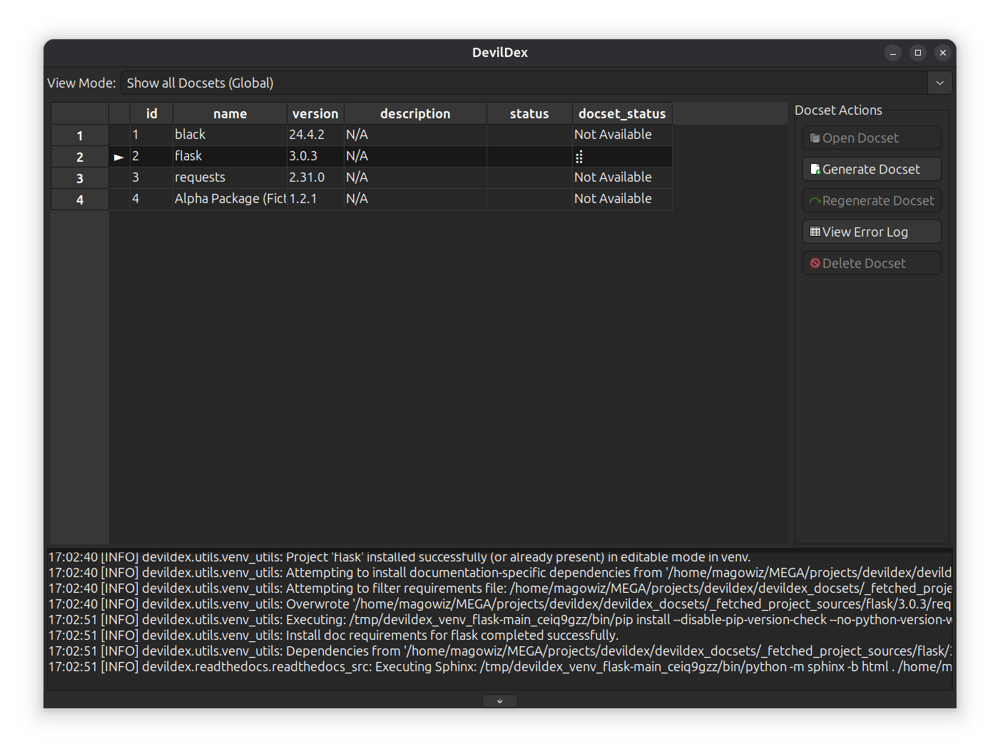
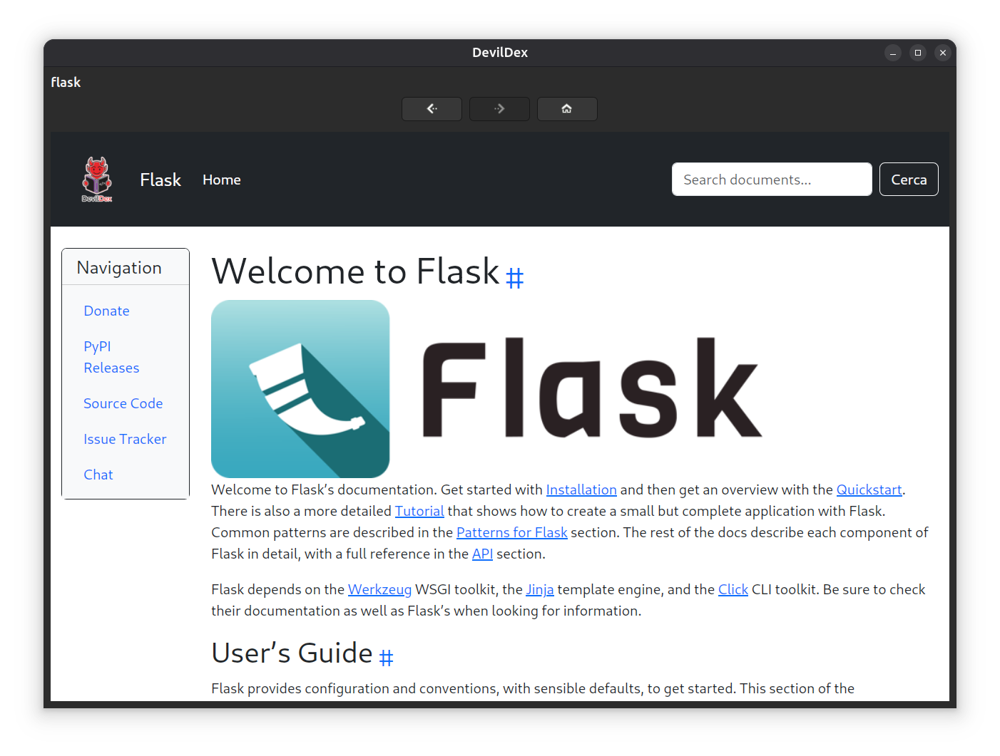
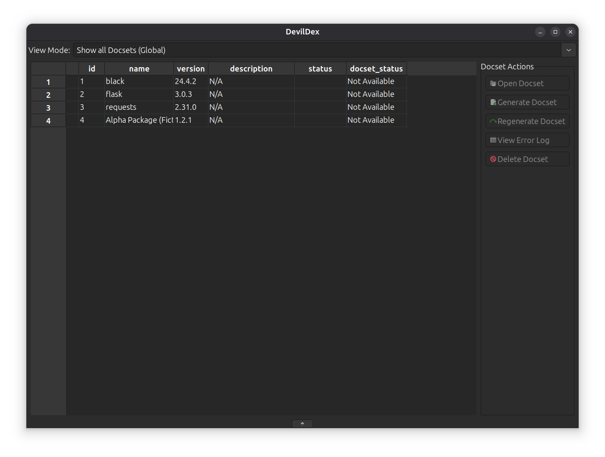

# DevilDex


[](https://github.com/magowiz/devildex/actions/workflows/python-tests.yml)

[](https://www.python.org/downloads/release/python-3130/)
[](https://python-poetry.org/)
[](https://codecov.io/gh/magowiz/devildex)


**DevilDex is a desktop application for discovering, generating, and viewing Python package documentation (docsets).** It scans your projects for dependencies, builds their documentation, and provides a unified interface to browse it all locally.

It's designed for developers who want quick, offline access to the documentation of the libraries they use every day.

## Key Features

-   **Project Scanning**: Automatically scans your Python projects (`pyproject.toml`, `requirements.txt`) to find all their dependencies.
-   **Docset Generation**: Uses tools like Sphinx, pdoc, and pydoctor to generate HTML documentation for your packages. 
-   **Uniform Theming**: Applies a consistent and professional DevilDex theme across different documentation generators (Sphinx, pdoc3, pydoctor, MkDocs) for a unified viewing experience.
-   **Integrated Viewer**: A built-in browser view to read and navigate the generated docsets without leaving the application. 
-   **Database Management**: Uses SQLAlchemy to keep track of your packages, projects, and available docsets.

-   **Cross-Platform GUI**: Built with the wxPython framework to run on multiple operating systems.



## Installation

### 1. System Dependencies
DevilDex, being a desktop application built with `wxPython`, relies on certain system-level libraries, especially for its webview component (`wx.html2.WebView`). While `pip install wxPython` handles most Python-level dependencies, you might need to install additional system packages depending on your operating system.

<details>
  <summary>Windows</summary>

Typically, no additional system dependencies are required beyond a standard Python installation, as `wxPython` wheels for Windows are usually self-contained.
</details>

<details>
  <summary>macOS</summary>

Similar to Windows, `pip install wxPython` should handle most dependencies. If you encounter issues, ensure you have Xcode Command Line Tools installed (`xcode-select --install`).
</details>

<details>
  <summary>Linux</summary>

For Linux distributions, you\'ll generally need GTK3 development libraries and WebKit2GTK. The specific package names vary by distribution.

<details>
  <summary>Debian/Ubuntu-based systems</summary>

```bash
sudo apt-get update
sudo apt-get install -y \
    libgirepository1.0-dev \
    gobject-introspection \
    gir1.2-gtk-3.0 \
    gir1.2-webkit2-4.1 \
    python3-gi \
    python3-gi-cairo \
    python3-wxgtk4.0 \
    python3-wxgtk-webview4.0
```
</details>

<details>
  <summary>Fedora-based systems</summary>

```bash
sudo dnf install -y \
    python3-wxpython4 \
    gtk3-devel \
    webkit2gtk4.1-devel
```
</details>

<details>
  <summary>Arch Linux-based systems</summary>

```bash
sudo pacman -Syu \
    python-wxpython \
    wxwidgets-gtk3 \
    webkit2gtk
```
</details>

</details>

### 2. Application Installation

DevilDex can be installed directly from a Python wheel package (`.whl`) if available, or from source for development purposes.

**Option A: Install from a Wheel Package (Recommended for Users)**

Wheel packages (`.whl`) are built and available as artifacts from successful GitHub Actions workflow runs. You can download the latest wheel from the [Build Python Wheel workflow](https://github.com/magowiz/devildex/actions/workflows/build-wheel.yml).

Once downloaded, you can install it using pip:

```bash
pip install path/to/your/downloaded/devildex-*.whl
```

<details>
  <summary>Note for Linux Users regarding wxPython</summary>
  On Linux, it is highly recommended to install `wxPython` and its dependencies (like `python3-wxgtk-webview4.0`) via your system\'s package manager (as described in the "System Dependencies" section) *before* installing the DevilDex wheel. When you run `pip install`, it will detect the system-wide `wxPython` installation and use it, preventing potential `NotImplementedError` issues with the WebView component.
</details>

**Option B: Install from Source (For Developers)**

For development or if you prefer to install from source, follow these steps:

1.  **Clone the repository:**
    ```bash
    git clone <repository-url>
    cd devildex
    ```

2.  **Install Python packages using Poetry:**
    ```bash
    poetry install
    ```

## How to Run

Once everything is installed, you can run the application with:

```bash
poetry run devildex
```

## Registering a Project with DevilDex

DevilDex needs to know about your projects and their associated Python virtual environments to scan them for documentation. This is done using the `devildex-register-project` companion script.

**Important:** You must run this script from within the **activated virtual environment** of the project you wish to register.

1.  **Activate your project\'s virtual environment:**
    ```bash
    # Example for a Poetry project
    poetry shell
    # Or for a standard venv
    source .venv/bin/activate
    ```

2.  **Navigate to your project\'s root directory:**
    ```bash
    cd /path/to/your/project
    ```

3.  **Run the registration script:**
    ```bash
devildex-register-project
    ```
    If your project\'s root directory is different from your current working directory, you can specify it:
    ```bash
devildex-register-project --project-path /path/to/your/project
    ```

After successful registration, DevilDex will be able to identify and manage documentation for the packages installed in that project\'s virtual environment.

## Contributing

Contributions are welcome! If you want to contribute to DevilDex, here’s how you can run the test suite.

**Running Tests**

The project uses `pytest`. To run the full test suite:

```bash
poetry run pytest
```

**Running UI Tests Headlessly**

The UI tests are designed to run in a headless environment (like in a CI pipeline) using `Xvfb`. To run them this way, use:

```bash
xvfb-run poetry run pytest
```

## License

This project is licensed under the GPL-3.0 License. See the `LICENSE` file for more details.
